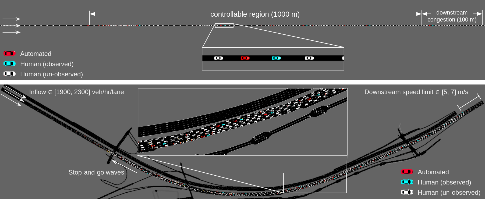

[](https://github.com/AboudyKreidieh/il-traffic/actions/workflows/ci.yml)

# Learning Energy-Efficient Driving Behaviors by Imitating Experts

Implementation of the code for the paper titled "Learning Energy-Efficient 
Driving Behaviors by Imitating Experts". To learn more, see the following 
links:

- **Paper:** TODO
- **Website:** https://sites.google.com/view/il-traffic/home

<p align="center"> &emsp; </p>
<p align="center">Imitation results on I-210. <b>Left:</b> baseline with stop-and-go waves. <b>Right:</b> imitated policy allowing for wave dissipation </p>

## Contents

1. [Setup Instructions](#1-setup-instructions)  
    1.1. [Basic Installation](#11-basic-installation)  
    1.2. [Docker Installation](#12-docker-installation)  
2. [Usage](#2-usage)  
    2.1. [Simulating Baseline and Expert Models](#21-simulating-baseline-and-expert-models)  
    2.2. [Imitating Experts](#22-imitating-experts)  
    2.3. [Evaluating Results](#23-evaluating-results)  
    2.4. [Downloading Models and Results](#24-downloading-models-and-results)  
3. [Citing](#3-citing)

## 1. Setup Instructions

### 1.1 Basic Installation

This repository is an extension of the [Flow](https://flow-project.github.io/)
repository. If you have not previously installed Flow, begin by following the 
setup instruction provided 
[here](https://flow.readthedocs.io/en/latest/flow_setup.html). Note that if you
are experiences issues with this, you may want to consider downloading and 
using the docker image instead (see [Section 1.2](#12-docker-installation)).

Once Flow has been installed, open a terminal and set the working directory of
the terminal to match the path to this repository:

```shell script
cd path/to/il-traffic
```

If you have installed Flow in conda environment, you will want to install this
repository in the same environment. If you followed the basic Flow setup 
instructions, this can be done my running the following command:

```shell script
source activate flow
```

Finally, install the contents of the repository onto your conda environment (or
your local python build) by running the following command:

```shell script
pip install --use-deprecated=legacy-resolver -e .
```

If you would like to (optionally) validate that the repository successfully
installed and is running, you can do so by executing the unit tests as follows:

```shell script
nose2
```

The test should return a message along the lines of:

    ----------------------------------------------------------------------
    Ran XXX tests in YYYs

    OK

### 1.2 Docker Installation

The current working version of Flow is missing some features, thereby 
preventing some operations within this repository from successfully running. As
a temporary measure, we have created a docker image that can be used to run any 
commands described within this README. To get the docker image running, first 
be sure to [set up docker](https://docs.docker.com/get-docker/) on your 
machine. Next, download the docker image for this repository by clicking on 
[this link](https://berkeley.box.com/shared/static/swh3mmhv5g1z7jn2bsb5kqczga1f1qyf.tar).
The link will download a "il-traffic.tar" file containing the contents of the 
docker image. To install the image onto your machine, run:

```shell script
docker load -i il-traffic.tar
```

Once this is done, you can run any command provided in this repository by 
prefixing it with `docker run -it --rm il-traffic`, replacing `python` with 
`python3`, and initializing the path to the script with `/`. For example, if 
you wish to [run a simulation](#21-simulating-baseline-and-expert-models), 
type:

```shell script
docker run -it --rm il-traffic python3 /il_traffic/scripts/simulate.py
```

> **Note:** When using graphical features with the docker image, care must be 
> taken to provide the display information to the docker execution script 
> above. The way in which this is done also differs from machine to machine, 
> making it difficult to arbitrarily assign in this document.

Another consideration when using docker is the redirection of logged data. The 
above script alone will not send any generated trajectory or imitation data to 
the host server. Instead, it will assume the data is to be stored in the image, 
and subsequently deleted once the instance is over. To redirect data to your 
local (host) machine, you will need to use the `-v` flag within docker. This 
can be done for each relevant script as follows:

- Simulation

  ```shell script
  docker run -it --rm -v $PWD/expert_data:/expert_data il-traffic python3 /il_traffic/scripts/simulate.py  # plus additional arguments
  ```

- Imitation

  ```shell script
  docker run -it --rm -v $PWD/imitation_data:/imitation_data il-traffic python3 /il_traffic/scripts/imitate.py  # plus additional arguments
  ```

- Evaluation (assuming the path to the trained model is under `MODEL_PATH`)

  ```shell script
  docker run -it --rm -v $MODEL_PATH:$MODEL_PATH il-traffic python3 /il_traffic/scripts/evaluate.py $MODEL_PATH  # plus additional arguments
  ```

## 2. Usage

We describe in the following subsections how different hand-designed baseline 
and AV (expert) models can be simulated within different networks, and describe
the imitation and evaluation procedures. Results from previous runs using this
repository can further be downloaded and visualized through the final 
subsection.

### 2.1 Simulating Baseline and Expert Models

Through this repository, simulations of both baseline (human-driven) behaviors 
and mixed-autonomy behaviors in which AVs follow a variety of different 
controllers can be conducted through the `simulate.py` script. The networks 
explored in this repository, see the figure below, include a single lane 
highway and simulated version of the I-210 network. A description of the 
process through which congestion forms in these model is available in our 
[paper](TODO).

<p align="center"></p>

To execute a simulation of the network, run:

```shell
python il_traffic/scripts/simulate.py
```

where the descriptions to additional arguments can be seen by running:

```shell script
python il_traffic/scripts/simulate.py --help
```

The above script will start a simulation of the network that can be visualized 
if `--render` is set. Moreover, if `--gen_emission` is set, this script will 
create a folder in "expert_data/{network}/{controller}/{inflow}-{end_speed}" 
containing the following files:

* avg-speed.png : a plot of the avg/std speeds of all vehicles at every time 
  step.
* emission.csv : the trajectory data collected from the simulation, containing 
  values that denote the speed, position, and accelerations conducted by all 
  vehicles at all time steps.
* mpg.csv : the energy values each individual vehicle experiences after moving 
  forward for 50 meters (in miles-per-gallon, or mpg).
* mpg.png : a plot of the mpg values contained in mpg.csv, with a line plot 
  used to represent the average values across time.
* ts-{0-4}.png : visualization of the trajectories of individual vehicles as 
  seen as a time-space diagram on each individual lane. The number after the 
  dash represents the lane number (0 for the highway and 0-4 for the I-210).
* tt.json : the time it takes every vehicle to traverse the network to the 
  downstream edge.

### 2.2 Imitating Experts

The behaviors of the baseline and expert controllers presented in the 
subsection above can be imitated to a neural network policy (or an ensemble of
policies) through the `imitate.py` method in the "scripts" folder. This 
method implements the DAgger algorithm, and provides additional augmentations 
to allow for the training of ensembles of (optionally stochastic) policies, as 
well as various other features such as dropout and batch normalization. To 
start the imitation procedure, run:

```shell script
python il_traffic/scripts/imitate.py
```

where the descriptions to additional arguments can be seen by running:

```shell script
python il_traffic/scripts/imitate.py --help
```

Once the imitation procedure has begun, it will create an "imitation_data" 
folder which will store the trained model after every training iteration. The 
folder will also contain a tensorboard log and "train.csv" file that describe 
the performance of the model at every iteration.

### 2.3 Evaluating Results

Once a given expert has been imitated, the performance of the model can be 
verified through the `evaluate.py` method by running:

```shell script
python il_traffic/scripts/evaluate.py "/path/to/results_folder"
```

where the first argument is the path to the folder created by the imitation 
method before, and the additional arguments can be seen by running:

```shell script
python il_traffic/scripts/evaluate.py --help
```

If the `--gen_emission` flag has been set, the script will create a new 
"results" folder in the original folder with the model containing trajectory 
data similar to the one created by the
[simulation procedure](#21-simulating-baseline-and-expert-models).

### 2.4 Downloading Models and Results

The trained models and trajectories provided within the paper and website are 
available to be downloaded and further analyzed. To download the existing 
models and trajectories, click on any of the relevant links below. For the 
trajectory data, the individual folders will contain content similar to what is
produced by the `simulate.py` and `evaluate.py` scripts.

* **Trained models:**

| Controller          | Model (5 seeds) |
|---------------------|-----------------|
| Imitated (1 frame)  | [1](https://berkeley.box.com/shared/static/ueyl2857e199rqee3k9mr7zsfg1lztky.gz) - [2](https://berkeley.box.com/shared/static/8t24lxu8igpmk1jv8nakojy7hrg72y12.gz) - [3](https://berkeley.box.com/shared/static/su1s2unsotcs0xy08c2x1xug3sjdesuw.gz) - [4](https://berkeley.box.com/shared/static/5w9l2hijyo31mu9n7x7dmkv472ymk4h7.gz) - [5](https://berkeley.box.com/shared/static/zsyphcsthp1i5ewpjx7ropdvws0ta97m.gz) |
| Imitated (5 frames) | [1](https://berkeley.box.com/shared/static/u7k9jud63615hsn1j4ybrrqnmfi8mmu9.gz) - [2](https://berkeley.box.com/shared/static/pf242utt7txld8f2xhv69qzn0k9w5auz.gz) - [3](https://berkeley.box.com/shared/static/675u01jyuunqy3text670a6g3dtv5rmi.gz) - [4](https://berkeley.box.com/shared/static/b0zwe2uufkxarovf33pw6ha177cslja4.gz) - [5](https://berkeley.box.com/shared/static/uo89m00bhvst72fsp0g9dewkwftslvi9.gz) |

* **Trajectories for different penetration rates:**

| Controller          | Penetration Rate | Trajectories (5 seeds) |
|---------------------|------------------|------------------------|
| Baseline            | 0 %              | [1](https://berkeley.box.com/shared/static/prnu669t27xbitd0we456xbrtgmcsh34.gz) - [2](https://berkeley.box.com/shared/static/o0w91x9veuq7oi2phksh9wwatnyqql42.gz) - [3](https://berkeley.box.com/shared/static/a276ngkvpndgi84fg5ps7bwy84jq4e4l.gz) - [4](https://berkeley.box.com/shared/static/l2l18z5stg0xfq8wt9c77o88gtxx1ht6.gz) - [5](https://berkeley.box.com/shared/static/qez85o986jfq9e31fu6wyxrfmi9ywg0n.gz) |
| Follower Stopper    | 2.5 %            | [1](https://berkeley.box.com/shared/static/x0zr73whvoac6drq4icqi6jdbtj4lcy5.gz) - [2](https://berkeley.box.com/shared/static/q41gvncm997i19n08qz2mya0p804jsb7.gz) - [3](https://berkeley.box.com/shared/static/yvhp5mtjj7vgo9wng6n27f9akeoiobdu.gz) - [4](https://berkeley.box.com/shared/static/qxv4yhcfg2i42k0t9m1g8ffodif9hbzy.gz) - [5](https://berkeley.box.com/shared/static/fuqen0cvy5j6jc6we71b13r2r10fr8zk.gz) |
|                     | 5.0 %            | [1](https://berkeley.box.com/shared/static/36p4e11hhcsa9fbz7gvckldw4e72ri4r.gz) - [2](https://berkeley.box.com/shared/static/my0poqxspqqbw0au05v7y8a6fd2acvl9.gz) - [3](https://berkeley.box.com/shared/static/weff1cakpbgazu8r9190ec8l92yy6zbk.gz) - [4](https://berkeley.box.com/shared/static/rol6znt7o1aevhdsh01e12kjwbrisg4l.gz) - [5](https://berkeley.box.com/shared/static/dbbqrmksfb0g3ta1zv3jotwq08eekqdh.gz) |
|                     | 7.5 %            | [1](https://berkeley.box.com/shared/static/qjz7kqbefngwo9zb45ki3pz5tblg7mhg.gz) - [2](https://berkeley.box.com/shared/static/tqlur0tzwlqa7t1bn20j7fmwrs6dzp5v.gz) - [3](https://berkeley.box.com/shared/static/1h2rzijp54xz5sduave39lpuebxd1xy6.gz) - [4](https://berkeley.box.com/shared/static/pbda61teut4llj2n5o97elngh9i8txwf.gz) - [5](https://berkeley.box.com/shared/static/ucrz9jk2waunnohmnxcanwl6fynzitdt.gz) |
|                     | 10.0 %           | [1](https://berkeley.box.com/shared/static/cno3bf7isq6jjqnitcj6ilfkfg2xz350.gz) - [2](https://berkeley.box.com/shared/static/7av5ep4aknobmcopr0nnp76d52ypfcyy.gz) - [3](https://berkeley.box.com/shared/static/t43h4wusbefwz0k46de1ieepxozygvkj.gz) - [4](https://berkeley.box.com/shared/static/j2q7rpcv890cc882qw5gbfgjnw17ttr5.gz) - [5](https://berkeley.box.com/shared/static/usimf3a41xza5knv3kc2c5jjclly0b1u.gz) |
| Imitated (1 frame)  | 2.5 %            | [1](https://berkeley.box.com/shared/static/fcu95j0667liuoihffgyvbu7n1d4q322.gz) - [2](https://berkeley.box.com/shared/static/qbcyzlxknknc5vsy7npl9wd2k429zpgf.gz) - [3](https://berkeley.box.com/shared/static/7lywwdomvhi70xyce8nxfltznqp81m6z.gz) - [4](https://berkeley.box.com/shared/static/3wvv6qer9dnaxe5ku58153zr90nfexh2.gz) - [5](https://berkeley.box.com/shared/static/at1rb0uiy24x55f4zu08q735ig5b00zy.gz) |
|                     | 5.0 %            | [1](https://berkeley.box.com/shared/static/hl3x3gd40irtg7zyklrgqqdvau9yy10i.gz) - [2](https://berkeley.box.com/shared/static/rfojxo09sszzfnsndagg197b6aqr3pz6.gz) - [3](https://berkeley.box.com/shared/static/qgsids7udtm3zbpvtosa4es8ums7adqk.gz) - [4](https://berkeley.box.com/shared/static/r7riy0kkj02hxkhgcv0jasm0ttfb7qo0.gz) - [5](https://berkeley.box.com/shared/static/967tts0ju3z7zwrgdhijridtz7zxjk38.gz) |
|                     | 7.5 %            | [1](https://berkeley.box.com/shared/static/f8gqgw5g6av3dx10qbznv6r39zdvq2s3.gz) - [2](https://berkeley.box.com/shared/static/yhk16gof5g0lhlsayplbooo3utudo710.gz) - [3](https://berkeley.box.com/shared/static/hfbq4d6en35sa44wbi4s9gvt69saxtyr.gz) - [4](https://berkeley.box.com/shared/static/ug6mfof9b5x1kekoh4qtlyhqw7sailbs.gz) - [5](https://berkeley.box.com/shared/static/6zifdj220bdt8pk3fezr1ddmy8lixzru.gz) |
|                     | 10.0 %           | [1](https://berkeley.box.com/shared/static/ctxmq5df8eutu3jh8v29i5xtf238fbuj.gz) - [2](https://berkeley.box.com/shared/static/zdcxqh0mowm4pzct03ge2x33volsbz9l.gz) - [3](https://berkeley.box.com/shared/static/g9a4mvxv6egvjztlx3szibzhqmrgkfbf.gz) - [4](https://berkeley.box.com/shared/static/mh23kstmh20imge2d0urs273e1xqjxks.gz) - [5](https://berkeley.box.com/shared/static/qjosxfsjbow65npy36qw5adg68nlhu7s.gz) |
| Imitated (5 frames) | 2.5 %            | [1](https://berkeley.box.com/shared/static/wm0me2ybusp9g1zvh63bq1e6nwqlldjt.gz) - [2](https://berkeley.box.com/shared/static/cbjehos64wqtov1418qh1lb2k12bvzsd.gz) - [3](https://berkeley.box.com/shared/static/ep147k9dqniw72tkhnlh9ly7d9e9ae8t.gz) - [4](https://berkeley.box.com/shared/static/quk1httrhzxnop7ad4nsur9h8mzl5mhm.gz) - [5](https://berkeley.box.com/shared/static/gejstg004p19e8afkzd54k2496lrc2d9.gz) |
|                     | 5.0 %            | [1](https://berkeley.box.com/shared/static/fhg7xygx5vy3m02kxrfdxm9wm6egxw1n.gz) - [2](https://berkeley.box.com/shared/static/nos7u1z86lf341mxq1f96g3lb7cci9x7.gz) - [3](https://berkeley.box.com/shared/static/css50i9mzu3vshbnm6u31hrovv8lpw9p.gz) - [4](https://berkeley.box.com/shared/static/qjgybk8v112wjzaow9893gd91aag4zwu.gz) - [5](https://berkeley.box.com/shared/static/nzahp4xeah6ym8qfqubu8epamm6hhjs3.gz) |
|                     | 7.5 %            | [1](https://berkeley.box.com/shared/static/hfhn0vpev8yyxekxq82uojtol6iivw4q.gz) - [2](https://berkeley.box.com/shared/static/8hlqksfohpds6on6h4cyu28bvunwt23k.gz) - [3](https://berkeley.box.com/shared/static/qrie3tmrx80sg3q1nlu14mycupsd6dhi.gz) - [4](https://berkeley.box.com/shared/static/po8fxgy1tnlicybbve8323vk4vd7m1mw.gz) - [5](https://berkeley.box.com/shared/static/3zsnft12ljee38kmjp3ploh0uackgb2h.gz) |
|                     | 10.0 %           | [1](https://berkeley.box.com/shared/static/m3n4yv1gudjfx6w78ndxn9188u0c0lul.gz) - [2](https://berkeley.box.com/shared/static/tuzk2gxpmk3ymrz66azyqb9d3cmzlyft.gz) - [3](https://berkeley.box.com/shared/static/qm1ea3jq0sgdedv0z8np9y7p03hgui4e.gz) - [4](https://berkeley.box.com/shared/static/0jc7u3oveh2k6aoif1g5p8dohf5swzzy.gz) - [5](https://berkeley.box.com/shared/static/gqznwvkqywfh0weinomo3s3qsbi40t7f.gz) |

* **Trajectories from robustness tests:**

| Controller          | Trajectories (5 seeds) |
|---------------------|------------------------|
| Baseline            | [1](https://berkeley.box.com/shared/static/abdfy0wzdhq0942f33l2kwpll2l191nm.gz) - [2](https://berkeley.box.com/shared/static/p1m9wb4eswde5ynngeku8683482x9xnh.gz) - [3](https://berkeley.box.com/shared/static/po9o9pyz9kfd5pteibsmicibrxcidrwd.gz) - [4](https://berkeley.box.com/shared/static/p8qpp78ctpoqrmuzrux3y7zk6mlo76b2.gz) - [5](https://berkeley.box.com/shared/static/l06cy70zygxdg5ofbahdle72nkfnjtx0.gz) |
| Follower Stopper    | [1](https://berkeley.box.com/shared/static/joa9hekreykej197x6o3muu6uefts15u.gz) - [2](https://berkeley.box.com/shared/static/9t1p2m0srgzzlt007jcpu4k1yv7fpe0l.gz) - [3](https://berkeley.box.com/shared/static/d8qjxj5owj39cku4xk85xfu0odwal9ez.gz) - [4](https://berkeley.box.com/shared/static/batvdnkk8vgreyx95nzg306bhtq3mm4s.gz) - [5](https://berkeley.box.com/shared/static/sckwfcoo44c4ur6fhc4hzoz7md6yldua.gz) |
| Imitated (1 frame)  | [1](https://berkeley.box.com/shared/static/sx730sigo0vugfs11ow8dnw0d4iy1e4k.gz) - [2](https://berkeley.box.com/shared/static/mr3d4e13upejwm0r9bg61rwv78vdh8gj.gz) - [3](https://berkeley.box.com/shared/static/hvn1h4gxbbbztlsytaweagvtg6tf3v3m.gz) - [4](https://berkeley.box.com/shared/static/dxwka9e6i9hpk7apesc5s4k9ygcqp28t.gz) - [5](https://berkeley.box.com/shared/static/1nj7wiox3prss4n46nysa1vck0a9ueju.gz) |
| Imitated (5 frames) | [1](https://berkeley.box.com/shared/static/k866ifx1q89smxhxspy9wriwp6dme9os.gz) - [2](https://berkeley.box.com/shared/static/r4wxftpcjoodl20ia2fkz3j7563g5a7i.gz) - [3](https://berkeley.box.com/shared/static/1yae5hnga57wctou954npzcz7g7ua2fq.gz) - [4](https://berkeley.box.com/shared/static/vit29p22ftynjq1fojg7eok21f6nag9p.gz) - [5](https://berkeley.box.com/shared/static/8pe65me9k00x4ugnr9c9ewp0xdht535n.gz) |

## 3. Citing

To cite this repository in publications, use the following:

TODO
